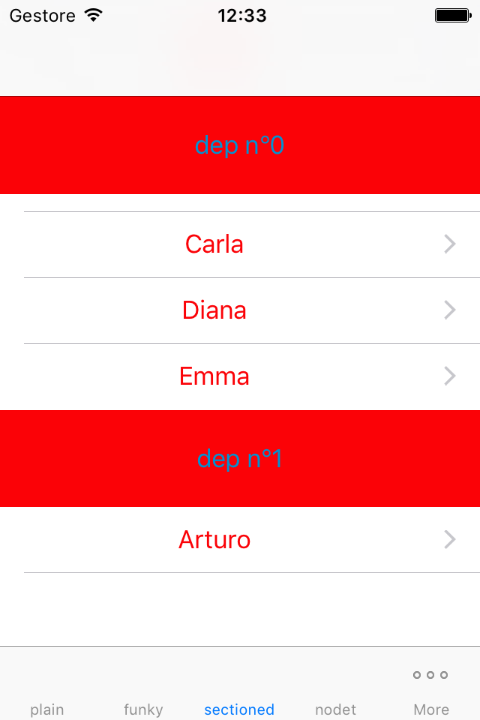

## DataVisualization

## Installation

DataVisualization is available through [CocoaPods](http://cocoapods.org). To install
it, simply add the following line to your Podfile:

```ruby
pod "DataVisualization", :git => 'https://github.com/hariseldon78/DataVisualization.git'
```
#### Screenshots





#### Usage

To run the example project, clone the repo, and run `pod install` from the Example directory first.

```swift
// Swift

import UIKit
import DataVisualization

class PlainViewController:UIViewController
{
    @IBOutlet weak var tableView: UITableView!
    var tvManager=AutoSearchableSingleLevelTableViewManager<Worker> (filteringClosure: { (d:Worker, s:String) -> Bool in
        return d.name.uppercaseString.containsString(s.uppercaseString)
    })
    override func viewDidLoad() {
        super.viewDidLoad()
        tvManager.setupTableView(tableView,vc:self)
		tvManager.setupOnSelect(.Detail(segue:"detail"))
    }
}
```
## Author

DataVisualization is written by 

Roberto Previdi <hariseldon78@gmail.com>
for 
Municipium s.r.l., Verona, Italy

## License

DataVisualization is available under the MIT license. See the LICENSE file for more info.

**Copyright (c) 2015 Municipium s.r.l.**


